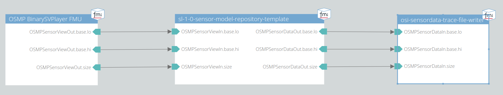

# 002 Object in FOV

This test checks if an object outside the field of view of the sensor is not detected by the model.

## System Structure Definition

The system consists of an OSMP binary trace file player, the model itself and a trace file writer.
The trace file player will read the given SensorView trace file as an input for the sensor model.
The output of the sensor model is written into a binary SensorData trace file for the subsequent analysis.

## Scenario

The scenario contained in the given trace file consists of a vehicle placed on the x-axis (y = 0) in front of the ego vehicle in the sensor's field of view.
The x-coordinates of the objects in this scenario are:

- ego: 10 m
- ego bbcenter2rear: -1.146 m
- object: 350 m

## Metric

The object is expected to be outside the field of view of the sensor at all times.
In the analyze.py script the average number of detected moving objects over all simulation time steps is calculated.

## Pass/Fail Criterion

The test fails, if it differs from the expectation value of 0.0.
