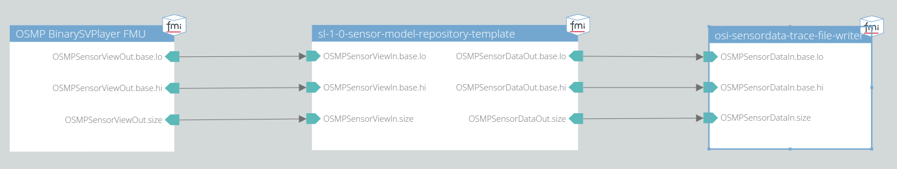

# 002 Object in FOV

This test checks if an object occluded by another object is still detected by the radar model due to multi path propagation beneath the occluding object.

## System Structure Definition

The system consists of an OSMP binary trace file player, the model itself and a trace file writer.
The trace file player will read the given SensorView trace file as an input for the sensor model.
The output of the sensor model is written into a binary SensorData trace file for the subsequent analysis.

## Scenario

The scenario contained in the generated trace file consists of two object vehicles placed on the x-axis (y = 0) in front of the ego vehicle in the sensor's field of view.
The x-coordinates of the objects in this scenario are:

- ego: 0 m
- ego bbcenter2rear: -1.5 m
- object 1: 30 m
- object 2: 50 m

## Metric

Both objects are expected to be seen.
In the analyze.py script the average number of detected moving objects over all simulation time steps is calculated.

## Pass/Fail Criterion

The test fails, if it differs from the expectation value of 2.0, as both vehicles are expected to be seen.
