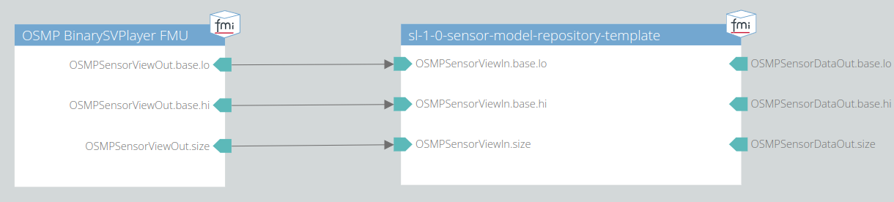

# 001 Smoke Test Trace File

This test checks if the model runs without any runtime errors when connected to a trace file player FMU.

## System Structure Definition

The system consists of an OSMP binary trace file player and the model itself.
The trace file player will read the given SensorView trace file as an input for the sensor model.
The output of the sensor model is disregarded.

## Scenario

The scenario contained in the given trace file consists of a vehicle placed on the x-axis (y = 0) in front of the ego vehicle in the sensor's field of view.
The x-coordinates of the objects in this scenario are:

- ego: 10 m
- ego bbcenter2rear: -1.146 m
- object: 25 m

## Metric

No runtime error.

## Pass/Fail Criterion

The test fails, if a runtime error occurs.
