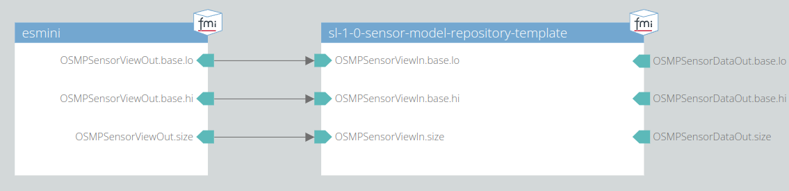

# 002 Smoke Test Trace Scenario

This test checks if the model runs without any runtime errors when connected to a scenario player FMU.

## System Structure Definition

The system consists of the [esmini scenario player FMU](https://github.com/esmini/esmini/tree/master/OSMP_FMU) and the model itself.
esmini will play the given OpenSCenario file as an input for the sensor model.
The output of the sensor model is disregarded.

## Scenario

The scenario contained in the given OpenScenario file consists of the ego vehicle driving on a straight road.
Another vehicle is overtaking from behind and cutting in front of the ego into the ego lane.

## Metric

No runtime error.

## Pass/Fail Criterion

The test fails, if a runtime error occurs.
